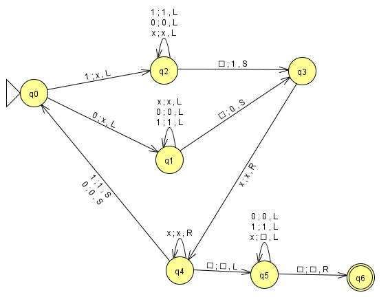
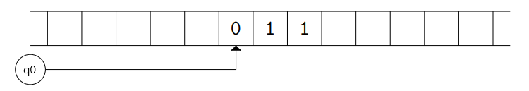
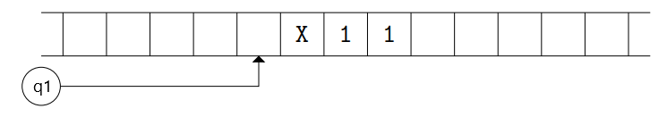
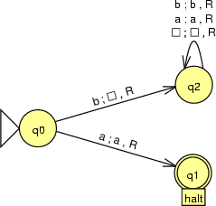

# Sprint 4 Problem Set

1. Complete this (easy and straightforward) [exercise](./ex1/ex1.md) using this JFLAP file [exercise1.jff](./ex1/exercise1.jff)

2. Often we think of TMs not so much as acceptors of languages as computers of functions. The input to the function is the initial content of the tape and the output is the final content of the tape when the TM reaches an accepting state.

    This TM computes a well known operation on a bit string.  
    

    To get a better understanding of what it does and how it operates, we can record the computational details for a typical input string. To begin, we write the input string 011 onto the tape of the Turing machine, position the read/write head at the first symbol, and set the current state to q0, the initial state of the Turing machine. This is shown pictorially:
    

    All other squares have blanks. At each step of the computation, the machine has a current state and the read/write head is positioned under one of the squares of the tape.

    From this point on, the transitions of the Turing machine dictate what happens to the current state, the read/write head, and the tape content. In this example, since the current state is q0 and the symbol under the read/write head is 0, the transition 0; X, L applies. This updates the current state (changing from q0 to q1), overwrites the 0 with X, and moves the read/write head one
position left:
    

    a. Determine the remaining sequence of actions for this input string, using the tape diagrams above as a guide (although you do not draw the tape each time). Each time the Turing machine makes a transition, record the tape content, the current state, and the position of the read/write head. This will take some patience, since an input of just three bits requires more than 30 transitions of the given Turing machine. You should discover that eventually the Turing machine will reach state q6, at which point it halts since there are no transitions which apply in that state.
   
    b. Describe (in your own words) how the TM works (see exercise 1 for a good description based on the Church-Turing thesis).


3. A TM has the following formal description:
```
({q0, q1, qf}, Σ = {0, 1}, Γ = Σ U {□}, q0, qf, δ)

δ(q0, 1) = (q0, 1, R)
δ(q0, 0) = (q0, 0, R)
δ(q0, □) = (q1, □, L)
δ(q1, 0) = (qf, □, L)
δ(q1, 1) = (qf, □, L)
```
Use JFLAP to construct the machine and determine it's mathematical purpose.  You will need to think about the quantity represented by the input and the eventual result.  It's not enough to just describe how the string is transformed.


4.  Consider the following intuitive description of a TM which takes an input of a bit string, adds 1 to the input and writes the computation as a result on the tape:

    The TM uses one state to initially scan from left to right without modifying any of the digits, until it encounters a blank (indicating the end of the input). At that point it changes into a new state in which it moves to the left, changing any 1's that it encounters to 0's, until the first time that it encounters a symbol other than 1. (This may happen before encountering any 1's.) If that symbol is 0, it changes it to 1 and enters a new state that moves leftward to a □ (blank) (indicating the beginning of the string) and then halts. On the other hand, if the symbol is a □ (blank), then the original input consisted exclusively of 1’s. In that case, the machine prepends a 1 to the input.

    Using JFLAP, construct (and test!) the described TM.  Save your machine as `exercise4.jff`.

5. Using JFLAP, construct (and test!) a machine that reads in an input string over the alphabet {a,b} and halts with the cell the read/write head points to containing 1 if the input's length is odd and a □ (blank) otherwise. For example, if "aabba" is on the tape when the machine starts, the read/write head should point to a cell containing 1 when the machine halts. I don't care what else is on the tape when the machine halts.  Save your machine as `exercise5.jff`.

6. One fun thing you can do with a Turing Machine is to send it into an infinte loop. The following machine halts if its input begins with a, and goes into an infinite loop otherwise. I mean, it's one way of showing that you don't like a string. You can think of it as throwing a tantrum.

    

    Use JFLAP to construct (and test!) a machine that halts when its input is a palindrome over {a,b} and goes into an infinite loop otherwise. What you leave on the tape is up to you.  Save your machine as `exercise6.jff`.

## Submission
Zip up any required `.jff` files and submit them to Canvas.  You can turn in the other answers either as a digital submission to Canvas or as a physical handin.  Make sure everyone's names are on the submission, but only one person needs to submit.

 
